This year for the #30DayChartChallenge I am going to dig back in the archives of the TidyTuesday repo and choose a dataset at random. I have much less time this year so my goal is to make quick plots (~ 30 min) and interpret the prompts generously. 

I am also using the challenge this year as an excuse to try out the `tidyplots` package. By the end of the month I hope to work out whether the package might be a good ggplot alternative for students needing simple but powerful plotting functions. 

This page will contain each of my final plots and the code that generates it, but if you want to look into how the plot came about, check out the associated blog post. 

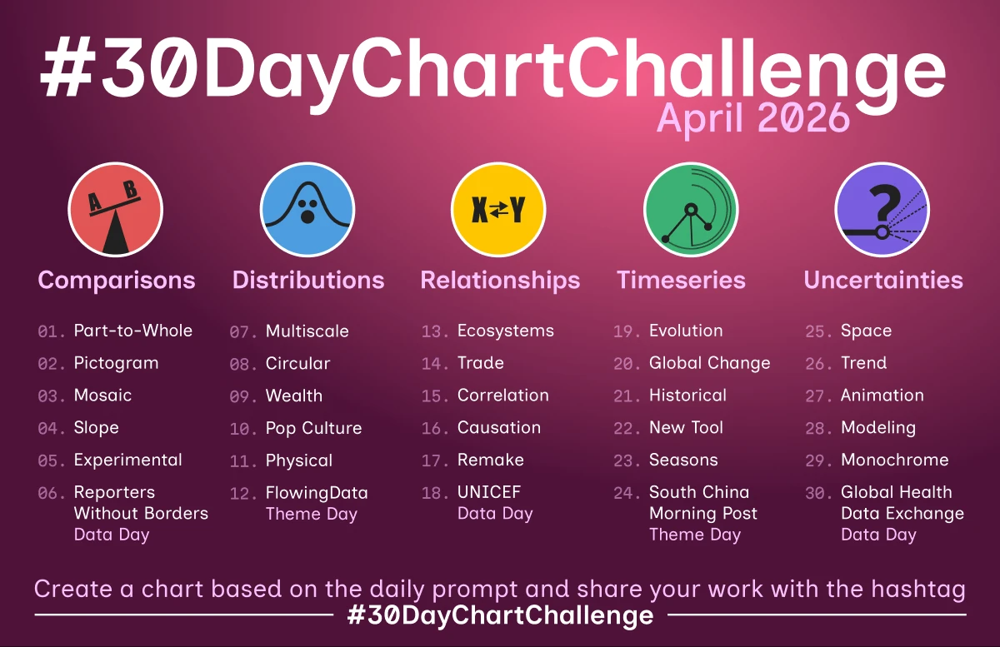

## Day 1 part-to-whole

[Australian Salaries by Gender](https://github.com/rfordatascience/tidytuesday/tree/main/data/2018/2018-04-23)

::: panel-tabset

### ggplot

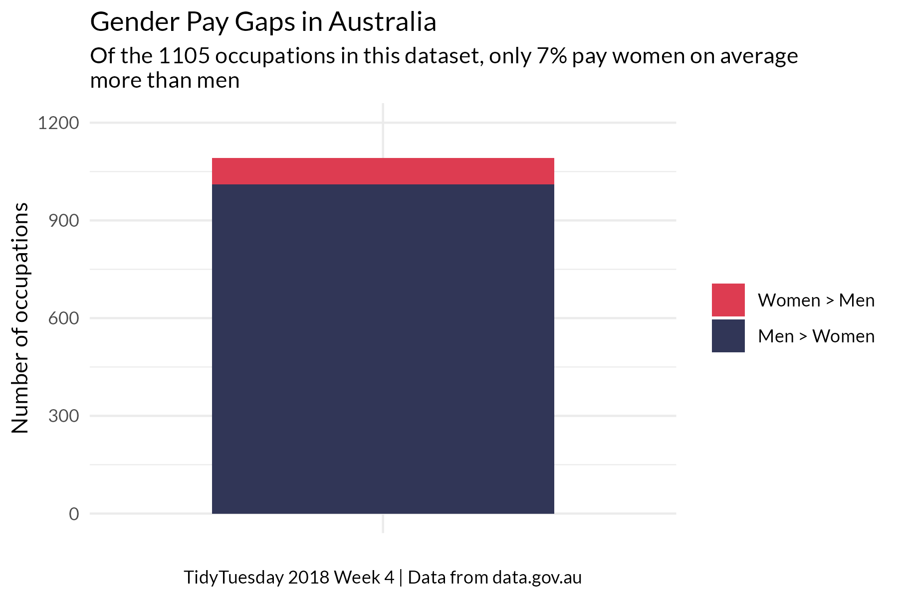

### tidyplot

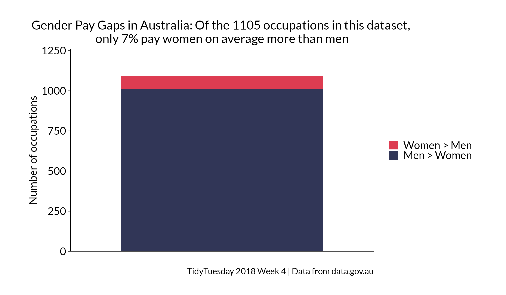

:::

## Day 4: slope

[palmtrees package ]("https://github.com/rfordatascience/tidytuesday/blob/main/data/2025/2025-03-18/readme.md")

::: panel-tabset

### ggplot

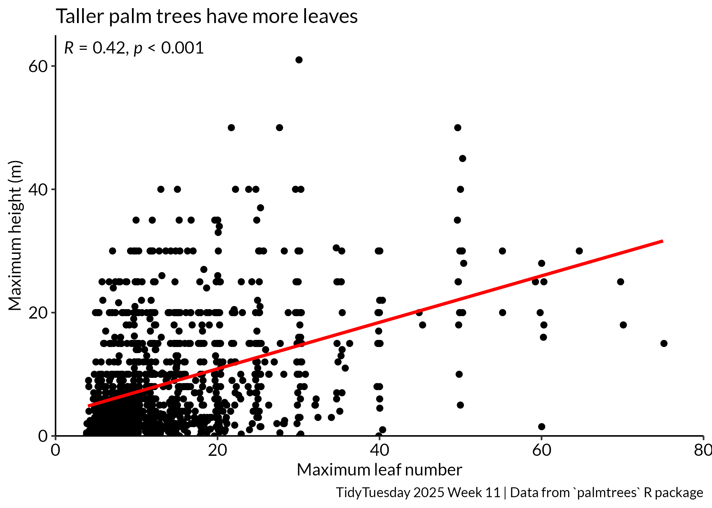

### tidyplot

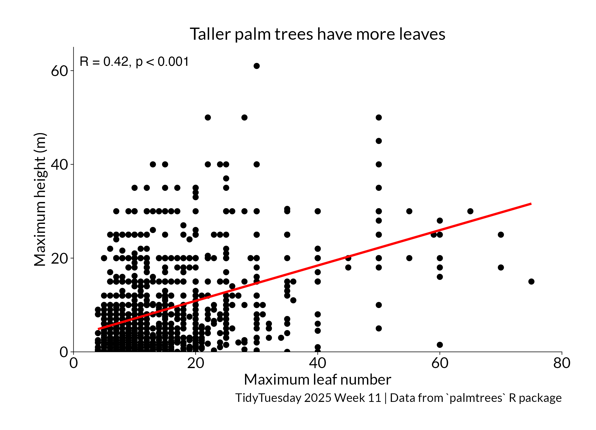
:::

## Day 8: circular

[Refugees]("https://github.com/rfordatascience/tidytuesday/blob/main/data/2023/2023-08-22/readme.md")

::: panel-tabset

### tidyplot

#### As conflict wears on, the number of people displaced within their own country increases. 

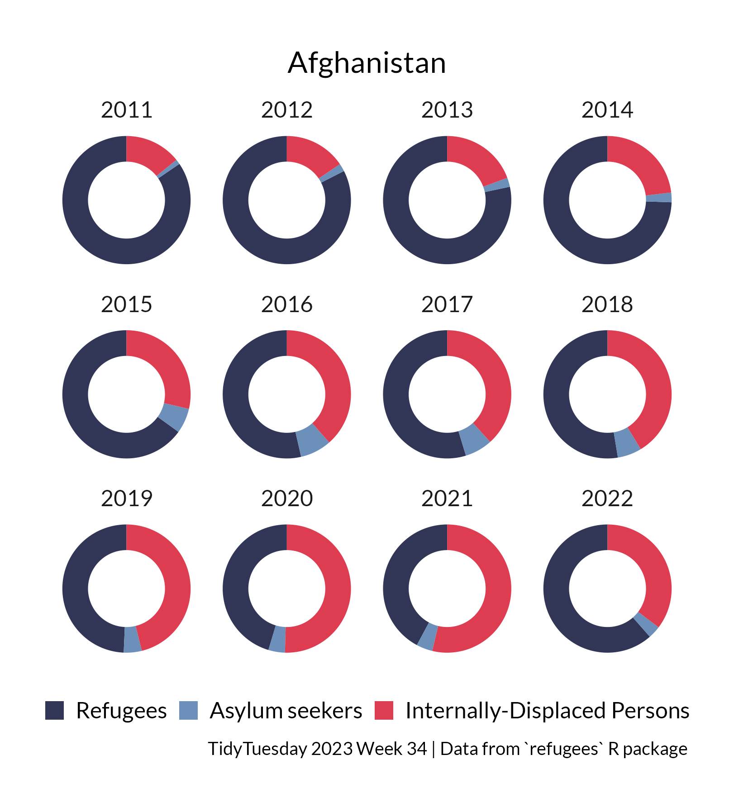
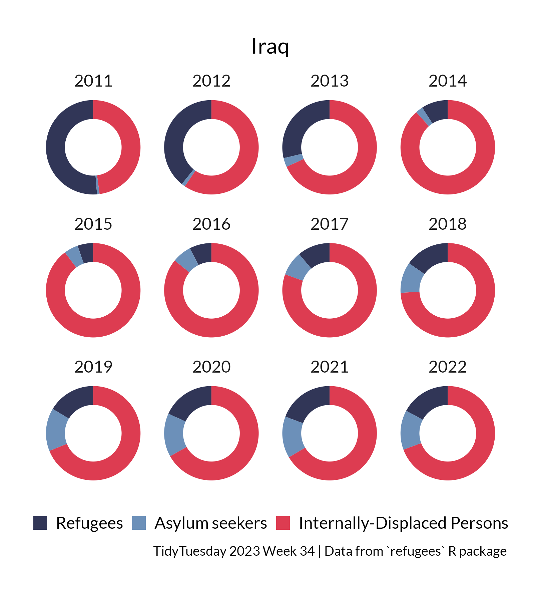

### ggplot

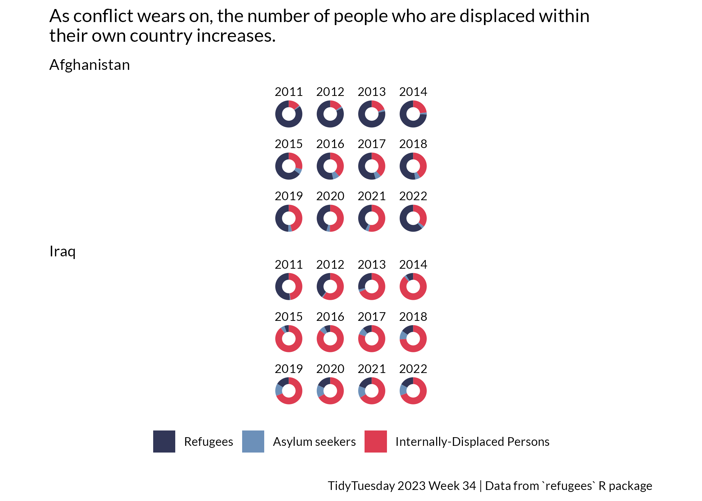
:::

## Day 15: correlation

[Animal Crossing]("https://github.com/rfordatascience/tidytuesday/blob/main/data/2020/2020-05-05/readme.md")

::: panel-tabset

### tidyplot

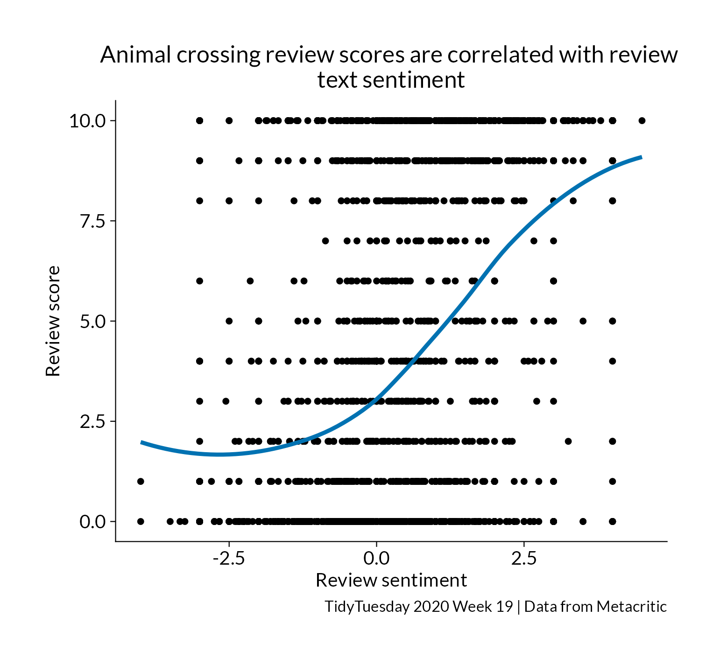
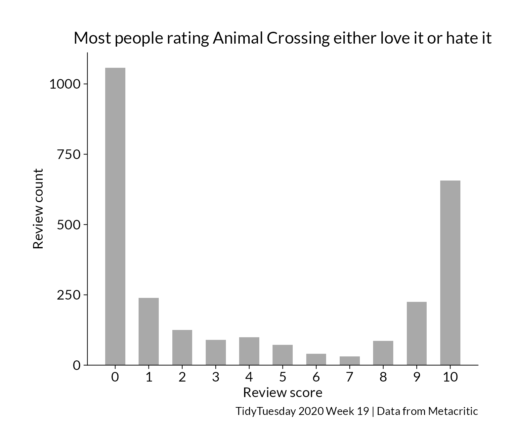

### ggplot

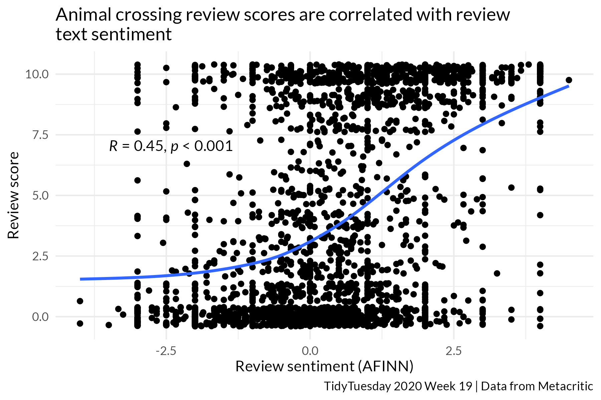

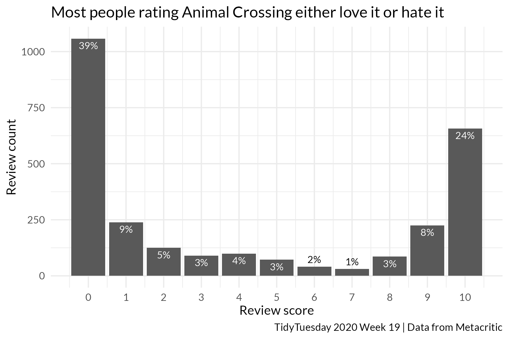
:::

## Day _____

[Dataset](URL)

::: panel-tabset

### tidyplot

### ggplot

:::

## Day _____

[Dataset](URL)

::: panel-tabset

### tidyplot

### ggplot

:::
