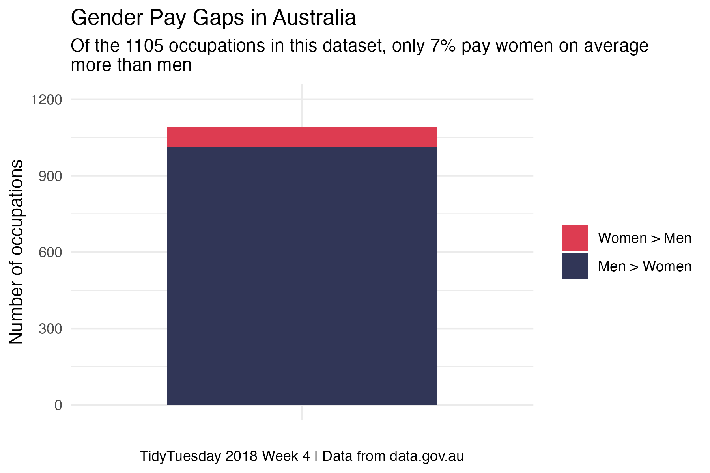

This year for the #30DayChartChallenge I am going to dig back in the archives of the TidyTuesday repo and choose a dataset at random. I have much less time this year so my goal is to make quick plots (~ 30 min) and interpret the prompts generously. 


This page will contain each of my final plots and the code that generates it, but if you want to look into how the plot came about, check out the associated blog post. 


## Day 1 part-to-whole

[Australian Salaries by Gender]("https://github.com/rfordatascience/tidytuesday/tree/main/data/2018/2018-04-23")

::: panel-tabset

### my plot



### r code

```{r, echo=TRUE, eval=FALSE}

summary %>%
  ggplot(aes(x = "", y = n, fill = bias)) +
  geom_col(width = 0.7) +
  labs(
    x = NULL,
    y = "Number of occupations",
    fill = NULL,
    title = "Gender Pay Gaps in Australia", 
    subtitle = "Of the 1105 occupations in this dataset, only 7% pay women on average \nmore than men", 
    caption = "TidyTuesday 2018 Week 4 | Data from data.gov.au"
  ) +
  theme_minimal() +
  scale_fill_manual(values = get_pal("Takahe")) +
  scale_y_continuous(limits = c(0,1200), breaks = seq(0, 1200, 300)) +
  theme(
    plot.caption = element_text(hjust = 0.5) # Centers the caption
  )
```
:::


## Day _____

[Dataset](URL)

::: panel-tabset

### my plot


### r code

```{r, echo=TRUE, eval=FALSE}


```
:::


## Day _____

[Dataset](URL)

::: panel-tabset

### my plot


### r code

```{r, echo=TRUE, eval=FALSE}


```
:::


## Day _____

[Dataset](URL)

::: panel-tabset

### my plot


### r code

```{r, echo=TRUE, eval=FALSE}


```
:::


