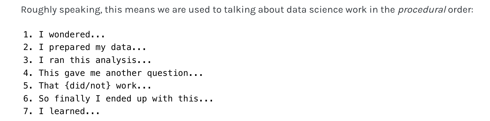

Emily Riederer wrote a great [blog post](%3Chttps://www.emilyriederer.com/post/quarto-comms) this week about storytelling in data science. Her take home was that that often we tell data stories in procedural order like this...

But actually the story is more engaging and meaningful like this when you tell it like this..

